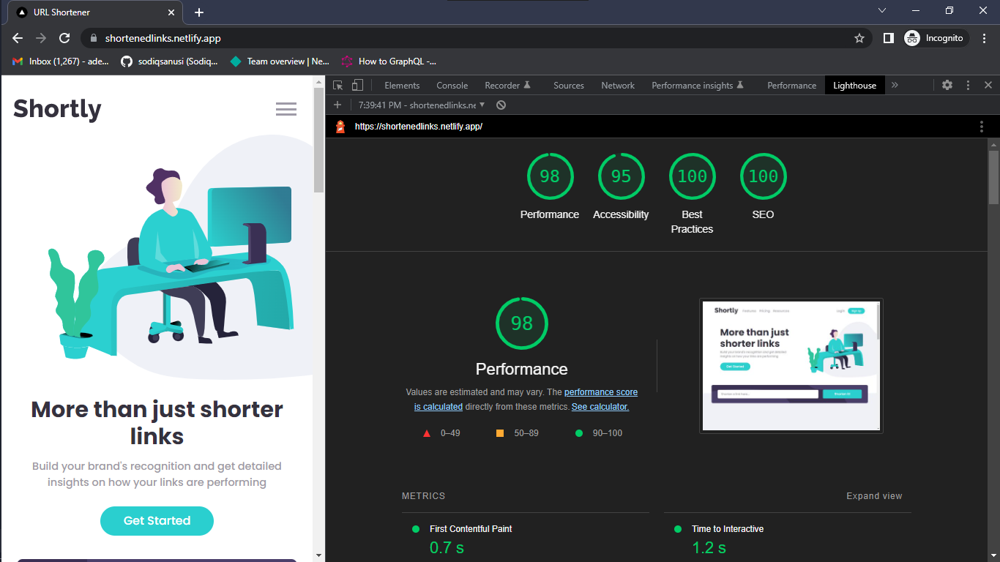

# Link Shortener

## Table of contents

- [Overview](#overview)
  - [The challenge](#the-challenge)
  - [Screenshot](#screenshot)
  - [Links](#links)
- [My process](#my-process)
  - [Built with](#built-with)
  - [What I learned](#what-i-learned)
  - [Continued development](#continued-development)
  - [Useful resources](#useful-resources)
- [Author](#author)
- [Acknowledgments](#acknowledgments)

## Overview
The goal was to build a web app that can create shortened URLs of an inputted link. This web app should also save the shortened links in the browser's webStorage, in a way that refreshing the browser doesn't remove the already shortened URLs. 

### The challenge
Users should be able to:

- View the optimal layout for the site depending on their device's screen size.
- Shorten any valid URL.
- See a list of their shortened links, even after refreshing the browser.
- Copy the shortened link to their clipboard in a single click.
- Receive an error message when the form is submitted if:
  - The input field is empty.
  - The input is not a valid URL.

### Screenshot

### Links
- Solution URL: [https://github.com/sodiqsanusi/url-shortener/](https://github.com/sodiqsanusi/url-shortener/)
- Live Site URL: [https://shortenedlinks.netlify.app/](https://shortenedlinks.netlify.app/)

## My process
Wow, this one was a whirlwind. Same old process by the way, if you don't know the old process, you can check [an older project I've built](https://github.com/sodiqsanusi/bookmark-landing-page#my-process), it's documented there. But, something new happened here😅. I was frustrated at a point during building this, that I skipped making functionalities for making it responsive for large screens. Did the functionalities last. After yelling at my PC, lol.

### Built with
- Mobile-first workflow
- [Next.js](https://nextjs.org/) - React framework
- CSS Modules - For styles

### What I learned
Damn. A lot of new things here.

- Getting and saving things in the browser's webStorage using either `localStorage` or `sessionStorage` web APIs.
- Using the Clipboard web API for copy & paste functionalities.
- A deeper understanding of react hooks.
- Better usage of client-side code in a static site generator (Next.js).

The fact that I was doing a lot of new things definitely kept me very motivated until the end of this project, although it also made me run into a lot of bugs earlier in the development😂.

### Continued development
Planning to start creating web apps/sites that has a functionality or design that I haven't worked on ever. Learning new things has this good feeling for real real. Will also brush up on my knowledge of web APIs, they are actually quite cool to use in projects (and very useful too!)

> Random question. Headsets or a bass speaker?

### Useful resources
- [localStorage in JavaScript: A complete guide - LogRocket Blog](https://blog.logrocket.com/localstorage-javascript-complete-guide/) - Like I said earlier, using the webStorage APIs were new to me, this helped a lot in making things easier to learn (along with the MDN docs).
- [shrtcode API Documentation](https://shrtco.de/docs) - The API I used in creating the short URLs. The docs are self-explanatory, so it was really easy implementing it in the project.
## Author
- Twitter - [@sodiqsanusi0](https://www.twitter.com/sodiqsanusi0)
- LinkedIn - [Sodiq Sanusi](https://www.linkedin.com/in/sodiqsanusi0)

## Acknowledgments
Uhmm, this one will go to Bernard, for introducing me to web development accidentally (funny how you link situations to crazy coincidences right?)
